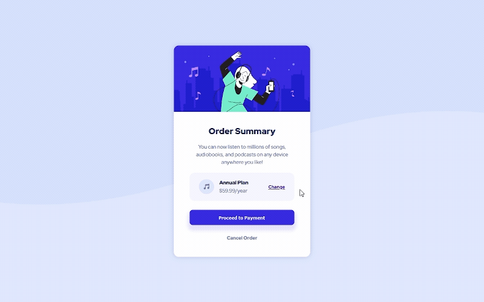

    

<h1 align='center'>Order Summary Challenge from Frontend Mentor</h1>

    <h2>
      <a href='https://order-summary-challenge-aqk1y0wgg-charbavito.vercel.app/#'> Live Version at Versel </a>
    </h2>

## The Challenge
This was a very easy Challenge to do, after all, the proposal was to build a simple card, with only CSS and HTML. Even though it was pretty easy to do, it was really good for reinforcing the fundamentals of layout build.

## Technology Used

    &nbsp; 
    &nbsp;
    &nbsp;
    &nbsp; 
    

## My Process

I started by configuring the project folder and initializing the version control sistem. Then I structured all the content senatically in HTML and started configuring the styles through SASS pre-processor. I finished the entire content and layout and finally proceeded to finalize the interactions using CSS hover pseudo-classes and editing the Readme file.

### What I learned
This was a very easy Challenge to do and despite not having learned anything very new, it was excellent to practice and strengthen the bases of layout and web development with CSS and HTML only.

### Useful resources
- [W3School References](https://www.w3schools.com/) - References to CSS and HTML 
- [W3C Markup Validation Service](https://validator.w3.org/#validate_by_input) - HTML5 and CSS3 code compliance check

## Acknowledgments

I thank the entire Frontend Mentor team for making this platform available with such useful and important content for those who are starting to venture into this Web Developer career. Thank you very much (again) :v::slightly_smiling_face:

